# Lucrare de laborator nr. 2. Cereri HTTP și șablonizare în Laravel
## Scopul lucrării
Să se studieze principiile de bază ale lucrului cu cererile HTTP în Laravel și șablonizarea folosind Blade, pe baza unei aplicații web „To-Do App pentru echipe” — o aplicație pentru gestionarea sarcinilor în cadrul unei echipe.

Aplicația este destinată unei echipe care dorește să își gestioneze sarcinile, să le atribuie membrilor și să monitorizeze starea și prioritatea sarcinilor (similar cu Github Issues).
## Condiții
### **Nr. 1. Pregătirea pentru lucru, instalarea Laravel**
1. Deschideți terminalul și creați un nou proiect Laravel cu numele todo-app (numele proiectului poate fi orice) folosind Composer: bash composer create-project laravel/laravel:^10 todo-app

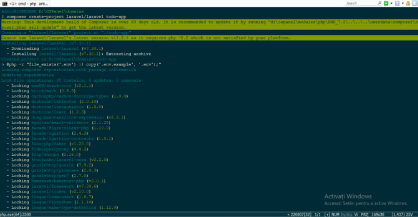

1. Intrați în directorul proiectului: bash cd todo-app
1. Porniți serverul încorporat Laravel: bash php artisan serve

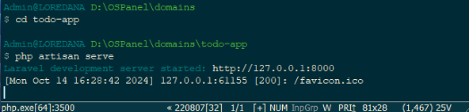

O pagină de start Laravel care conține un mesaj de bun venit și câteva informații despre Laravel.

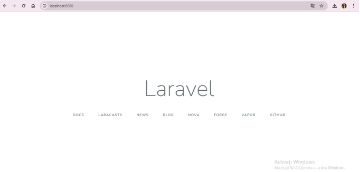

**Nr. 2. Configurarea mediului**

1. Deschideți fișierul .env și setați următoarele configurări ale aplicației: ini APP\_NAME=ToDoApp APP\_ENV=local APP\_KEY= APP\_DEBUG=true APP\_URL=http://localhost:8000

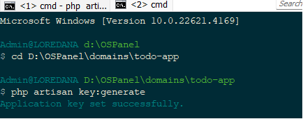

Generați cheia aplicației, care va fi utilizată pentru criptarea datelor: bash php artisan key:generate 

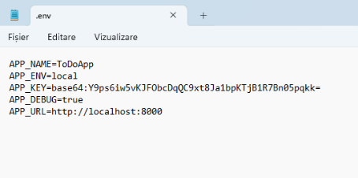

**Ce s-ar întâmpla dacă această cheie ar ajunge pe mâna unui răufăcător?**

Dacă un atacator ar obține cheia aplicației, el ar putea:

- **Decripta informațiile** sensibile stocate în aplicație (de exemplu, parolele utilizatorilor).
- **Falsifica sesiuni** sau **cookie-uri**, ceea ce ar putea permite atacatorului să se autentifice ca utilizator legitimat.
- Compromite întreaga aplicație, punând în pericol datele utilizatorilor și integritatea aplicației.

**Nr. 3.1. Crearea rutelor pentru pagina principală și pagina "Despre noi"**

1. Creați un controller HomeController pentru gestionarea cererilor către pagina principală.

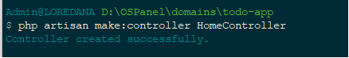

1. Adăugați metoda index în HomeController, care va afișa pagina principală.

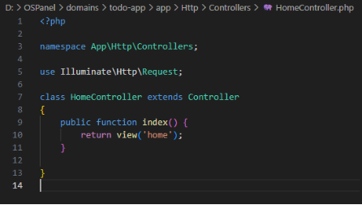

1. Creați ruta pentru pagina principală în fișierul routes/web.php. php public function index() { return view('home'); }
   1. Deschideți browserul și accesați adresa http://localhost:8000. Asigurați-vă că pagina goală se încarcă, deoarece vizualizarea home.blade.php nu a fost încă creată.

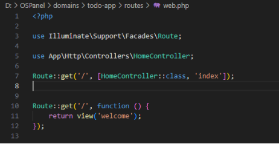

1. În același controller HomeController, creați o metodă pentru pagina **"Despre noi"**.

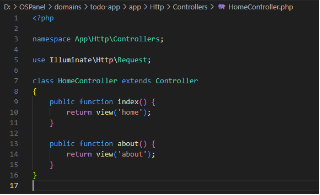

1. Adăugați ruta pentru pagina "Despre noi" în fișierul routes/web.php.

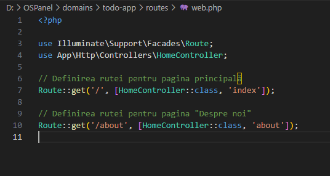

\*pentru verificare am creat un fisier și m-am asigurat că totul funcționează corect

**Nr. 3.2. Crearea rutelor pentru sarcini**

1. Creați un controller TaskController pentru gestionarea cererilor legate de sarcini și adăugați următoarele metode:
   1. index — afișarea listei de sarcini;
   1. create — afișarea formularului pentru crearea unei sarcini;
   1. store — salvarea unei sarcini noi;
   1. show — afișarea unei sarcini;
   1. edit — afișarea formularului pentru editarea unei sarcini;
   1. update — actualizarea sarcinii;
   1. destroy — ștergerea sarcinii.

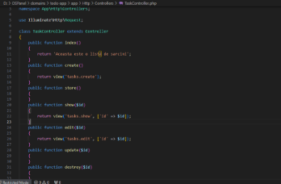

**Notă**: *Deoarece încă nu am studiat lucrul cu formulare și cereri POST și PUT, metodele store, create, edit, update, destroy trebuie lăsate goale. Ne vom întoarce la ele mai târziu în curs. În acest moment, ne concentrăm pe afișarea informațiilor.*

1. Creați rutele pentru metodele controllerului TaskController în fișierul routes/web.php și specificați metodele HTTP corecte pentru fiecare rută.

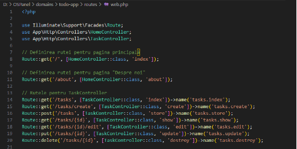

1. Utilizați gruparea rutelor pentru controllerul TaskController cu prefixul /tasks pentru a simplifica rutarea și a îmbunătăți lizibilitatea codului.

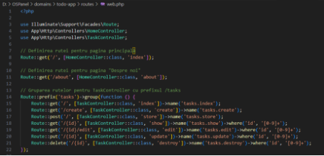

1. Definiți nume corecte pentru rutele controllerului TaskController, de exemplu:
- tasks.index — lista de sarcini
- tasks.create — afișarea formularului pentru crearea unei sarcini
- tasks.store — salvarea unei sarcini noi
- tasks.show — afișarea unei sarcini
- tasks.edit — afișarea formularului pentru editarea unei sarcini
- tasks.update — actualizarea sarcinii
- tasks.destroy — ștergerea sarcinii
1. Adăugați validarea parametrilor rutei id pentru sarcini. Asigurați-vă că parametrul id este un număr întreg pozitiv. Utilizați metoda where pentru a limita valorile parametrului id.

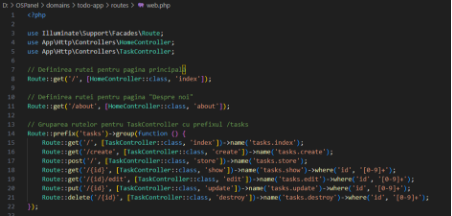

1. În loc să creați manual rute pentru fiecare metodă, puteți folosi **un controller de resurse**, care va crea automat rute pentru toate operațiunile **CRUD**:

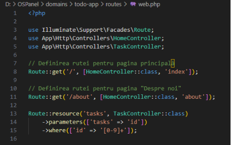

1. **Întrebare**: Explicați diferența între crearea manuală a rutelor și utilizarea unui controller de resurse. Ce rute și ce nume de rute vor fi create automat?
- **Crearea manuală a rutelor** implică definirea fiecărei rute individual, ceea ce poate duce la cod redundat și mai greu de întreținut.
- **Utilizarea unui controller de resurse** simplifică acest proces prin generarea automată a rutelor pentru toate operațiunile CRUD, ceea ce face codul mai curat și mai ușor de citit.
- Rutele și numele generate automat vor fi exact aceleași ca cele definite manual, dar cu mult mai puțin cod necesar.

1. Verificați rutele create cu ajutorul comenzii php artisan route:list.

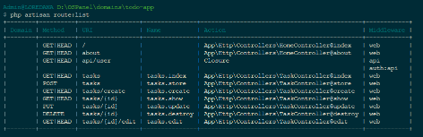

**Nr. 4. Șablonizarea folosind Blade**

**Nr. 4.1. Crearea unui layout pentru pagini**

1. Creați un layout pentru paginile principale layouts/app.blade.php cu următoarele elemente comune ale paginii:
   1. Titlul paginii;
   1. Meniu de navigare;
   1. Conținutul paginii.
1. Folosiți directiva @yield pentru a defini zona în care va fi inserat conținutul diferitelor pagini.

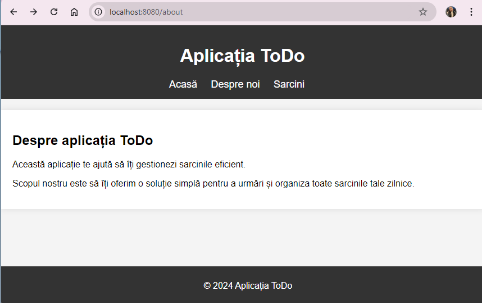

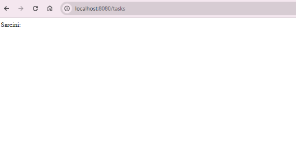

**Nr. 4.2. Utilizarea șabloanelor Blade**

1. Creați vizualizarea pentru pagina principală home.blade.php folosind layoutul layouts/app.blade.php în directorul resources/views.
1. Pe pagina principală trebuie să fie:
   1. **Mesaj de bun venit**: titlu și o scurtă descriere a aplicației, de exemplu „To-Do App pentru echipe”.
   1. **Navigație**: linkuri către secțiunile principale, cum ar fi:
   1. Lista de sarcini;
   1. Crearea unei sarcini.

      3. **Informații despre aplicație**: o scurtă descriere a scopului aplicației și a principalelor sale funcții.
1. Creați vizualizarea pentru pagina "Despre noi" — about.blade.php folosind layoutul layouts/app.blade.php în directorul resources/views.
1. Creați vizualizări pentru sarcini cu următoarele șabloane în directorul resources/views/tasks:

   1. index.blade.php — lista de sarcini;
   1. show.blade.php — afișarea unei sarcini;
   1. ...
1. Randați lista de sarcini pe pagina index.blade.php folosind date statice transmise din controller cu ajutorul directivei @foreach.

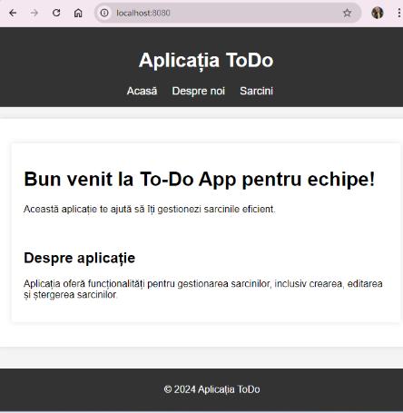

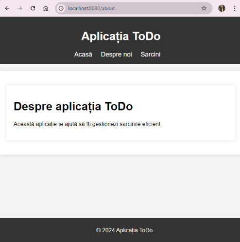

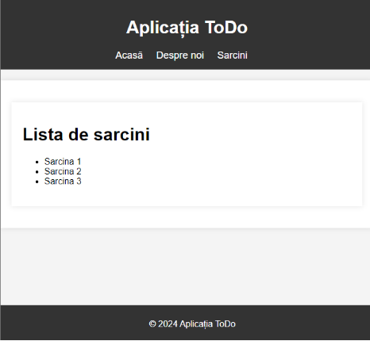

Răspunsurile la întrebări:

**1. Ce este un controller de resurse în Laravel și ce rute creează?**

Un **controller de resurse** în Laravel este un tip special de controller care simplifică gestionarea operațiunilor de tip CRUD (Create, Read, Update, Delete) pentru un model specific. Când creezi un controller de resurse folosind comanda Artisan (php artisan make:controller TaskController --resource), Laravel generează automat un set de metode standard pentru a manipula resursele, precum:

- index - pentru a lista toate resursele (GET /tasks)
- create - pentru a afișa formularul de creare a unei resurse (GET /tasks/create)
- store - pentru a salva o nouă resursă (POST /tasks)
- show - pentru a vizualiza o resursă specifică (GET /tasks/{id})
- edit - pentru a afișa formularul de editare a unei resurse (GET /tasks/{id}/edit)
- update - pentru a actualiza o resursă existentă (PUT/PATCH /tasks/{id})
- destroy - pentru a șterge o resursă (DELETE /tasks/{id})

**2. Explicați diferența între crearea manuală a rutelor și utilizarea unui controller de resurse.**

- **Crearea manuală a rutelor** implică definirea individuală a fiecărei rute în fișierul web.php, specificând metoda HTTP și controllerul asociat. Aceasta poate deveni rapid complexă și poate duce la duplicarea codului.
- **Utilizarea unui controller de resurse** simplifică gestionarea rutelor, deoarece Laravel poate genera automat rutele necesare pentru operațiunile CRUD. Acest lucru reduce cantitatea de cod pe care trebuie să o scrii și asigură o organizare mai bună a aplicației tale. De asemenea, rutele sunt mai ușor de gestionat și de întreținut.

**3. Ce avantaje oferă utilizarea componentelor anonime Blade?**

- **Reutilizare a codului**: Componentele anonime permit reutilizarea blocurilor de cod în diferite părți ale aplicației, reducând duplicarea și îmbunătățind organizarea codului.
- **Abstracție**: Ele ascund detaliile implementării, permițând dezvoltatorilor să se concentreze pe logica aplicației și să utilizeze componentele fără a se îngrijora de modul în care sunt implementate.
- **Flexibilitate**: Componentele pot accepta parametri prin directiva @props, făcându-le foarte flexibile și personalizabile pentru diferite cazuri de utilizare.
- **Îmbunătățirea performanței**: Utilizarea componentelor poate duce la un timp de încărcare mai rapid, deoarece acestea pot fi optimizate și folosite eficient de Laravel.

**4. Ce metode de cereri HTTP sunt folosite pentru a executa operațiunile CRUD?**

- **Create**: POST - Este folosită pentru a crea o nouă resursă.
- **Read**: GET - Este folosită pentru a obține și vizualiza resurse existente.
- **Update**: PUT sau PATCH - Este folosită pentru a actualiza o resursă existentă.
- **Delete**: DELETE - Este folosită pentru a șterge o resursă.

